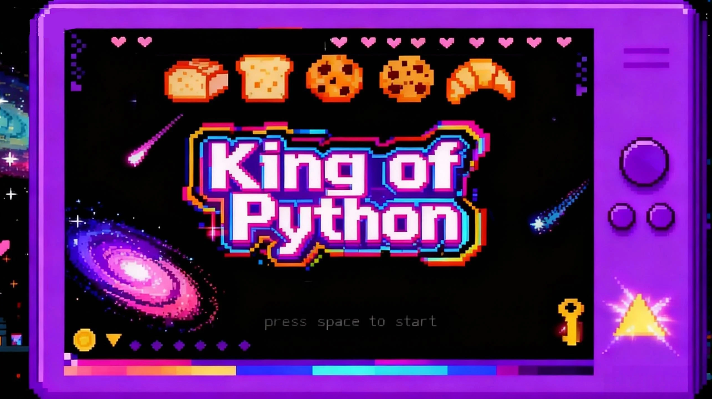

## King of Python 

Battle on a mechanical keyboard using Python code!

King of Python is a local two-player fighting game built with Pygame. It combines real-time face capture technology with programmer humor, turning players into code warriors battling in front of a flowing code screen.




Uploading GameVideo.mp4…


---

## Game Features
Real-time Face Capture Avatar:
- Uses OpenCV and MediaPipe to capture player faces at game startup.
- Automatically converts real faces into pixel-art game character avatars.
Mechanical Keyboard Battlefield:
- The arena is composed of giant keyboard keys (Space, Shift, Tab, QWER...).
- Dynamic environment: Tab key moves left and right, Shift key breaks when stepped on too long!
Programmer-Exclusive Skills:
Pick up falling code bubbles to unleash print(), super(), or throw a TypeError at your opponent!

---

## Controls

| Action          | Player 1 (Blue) | Player 2 (Red) |
|-----------------|-----------------|----------------|
| Move left       | `A`             | `←`            |
| Move right      | `D`             | `→`            |
| Jump            | `W`             | `↑`            |
| Attack / skill  | `F`             | `L`            |
| Quit            | `Esc`           | `Esc`          |
| Restart (post win screen) | `Space` | `Space` |

Gamepad input is not wired up; keyboard is required.

---

## Skill Bubble Probabilities 
`main.py` lines around 396 define the spawn weights. Probabilities sum to 100%.

| Bubble      | Effect (per `entities/player.py`)                                  | Probability |
|-------------|---------------------------------------------------------------------|-------------|
| `pow()`     | Melee slash for 8 HP + knockback                                     | 30%         |
| `delete`    | Removes opponent skill on hit                                        | 15%         |
| `print`     | Launches projectile for 2 HP                                         | 10%         |
| `super()`   | Giant mode ~5 s, contact damage & aura                               | 8%          |
| `Ctrl+C`    | Freezes picker for 3 s and deals 3 HP self-damage                    | 27%         |
| `TypeError` | Reverses controls for 10 s and deals 3 HP self-damage                | 25%         |

---

## Requirements
- Python 3.9+ (tested on Windows; works on macOS/Linux with SDL-compatible build)
- Pygame ≥ 2.5
- Pillow ≥ 9.0
- OpenCV (`opencv-python`) ≥ 4.6
- NumPy ≥ 1.22
- **Optional**: MediaPipe ≥ 0.10 for improved face detection (falls back to Haar cascade if missing)

Install dependencies inside a virtual environment:

```bash
python -m venv .venv
.venv\Scripts\activate        # PowerShell on Windows
pip install pygame opencv-python pillow numpy mediapipe
```

If you skip avatars or MediaPipe fails to install, set `DISABLE_FACE=1` before launching to avoid camera initialization.

---

## Running the Game
```bash
cd King-of-Python
python main.py
```

Optional face-login flow (saves circular PNG avatars under `face_detection/outputs/`):

```bash
cd King-of-Python
python -m face_detection.face_login_demo
```

- Press `Space` on the start screen to capture faces and enter the arena.
- Press `Space` on the victory overlay to restart without closing the window.

### Disabling Webcam Capture
- One-off session: `set DISABLE_FACE=1` (PowerShell) before running `python main.py`.
- Permanent (Windows): `setx DISABLE_FACE 1` then restart your shell.

---

## Project Layout (key folders)

| Path / Module        | Purpose |
|----------------------|---------|
| `main.py`            | Game loop, bubble logic, audio hooks, UI rendering.
| `settings.py`        | Global constants (resolution, fonts, colors, spawn timers).
| `entities/`          | Player, bubble, projectile, and platform classes.
| `Backround/`         | Animated background modules (`backround_1`, `backround_2`).
| `Start/StartGame.py` | Title screen + menu flow.
| `final/score.py`     | Score overlay animation.
| `face_detection/`    | Webcam capture helpers, OpenCV/Mediapipe utilities.
| `assets/`            | Music, SFX, and sprite resources (e.g., `magic_hit_lightning.mp3`).
| `fonts/`             | Ark Pixel font required for menus, HUD, and bubble labels.

---

## Troubleshooting & Tips
Camera won't start?
- Check if other programs are using the camera.
- If you don't want to use face features, press S key on the start screen to skip, or set DISABLE_FACE=1 in system environment variables.
Missing audio or errors?
- Ensure the assets folder is complete and contains files like magic_hit_lightning.mp3, Game sound.mp3, etc.

---

## Contributing
1. Fork and clone the repo.
2. Create a new branch per feature.
3. Keep art/audio sources compliant with their licenses and document additions in this README.
4. Submit a PR describing gameplay/test scenarios (e.g., skill probabilities, camera toggles).

---

## License
This project is for learning and entertainment purposes only.
